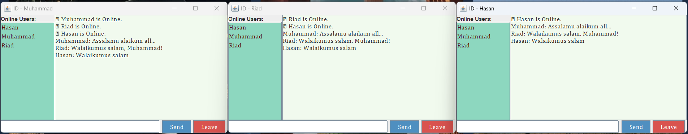
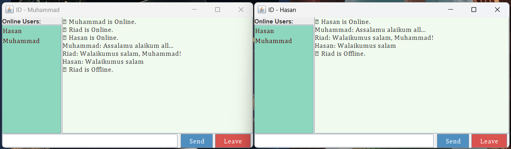

# Group Chat Application

## 📝 Summary

This is a simple **Group Chat** application built using **Java Socket Programming**. Multiple users can join the same chat room, send real-time messages, view the list of online users, and gracefully leave the chat. It's a clean and interactive group communication system.

---

## ⭐ Features

- Real-time group messaging  
- Displays online users in a side panel  
- Notifies when a user joins or leaves  
- Leave button to disconnect from chat
  
---

## 🛠️ Technology Used

- Java (JDK)  
- Java Swing GUI components:  
  - `JFrame`, `JPanel`, `JTextArea`, `JButton`, `JList`, etc.  
- Java Networking:  
  - `Socket`, `ServerSocket`  
- Multithreading for handling multiple clients  

---

## 🖼️ Interface

---

## ▶️ How to Run

 - Run the Server Code first
 - Then run client's code to connect with server

---

## 👤 Author

**Md. Riad Hasan**  
BSCSE   
**Uttara University**

---
